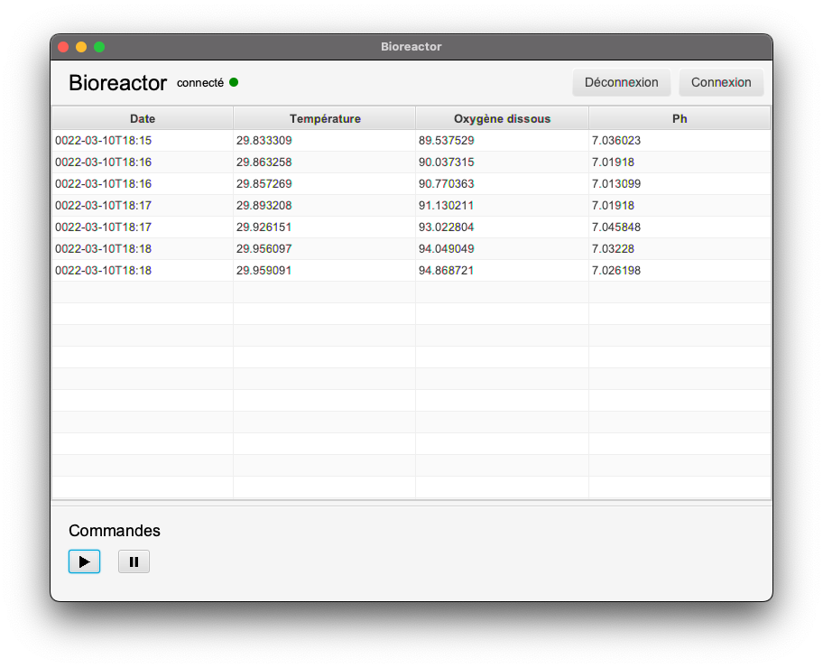

# Bioreactor


<div align="center">
  <center></center>
</div>


Le thème de ce projet se situe dans le contexte d’un Jumeau Numérique de bioréacteur en
version distribuée, exécution sur plusieurs machines. L’émulateur joue le rôle d’un bioréacteur
avec dans notre cas l’exploitation d’un fichier de données qui contient le résultat d’une
expérience d’un fermenteur avec les valeurs de température, oxygénation, et acidité (et
quelques autres paramètres que nous ignorerons). Notre émulateur va donc rejouer
l’expérimentation en délivrant les données sélectionnées vers qui veut observer les
résultats de l’expérience.

### Utilisation

Pour utiliser ce projet, il faut d'abord cloner le projet sur votre machine. 
Ensuite, rendez-vous dans le dossier du projet et exécutez la commande suivante pour installer les dépendances.
```bash
mvn clean install
```
Il faut ensuite ouvrir le projet dans votre IDE préféré et exécuter la classe `Main` du package `server`pour lancer serveur.
Ensuite, exécutez la classe `Main` du package `client` pour lancer le ou les clients.


### Technologies utilisées

- Java 17 (JDK 17) `graalvm-ce-17`
- JavaFX 17 `openjfx-17` 
- BootstrapFX 17 `bootstrapfx-17`

